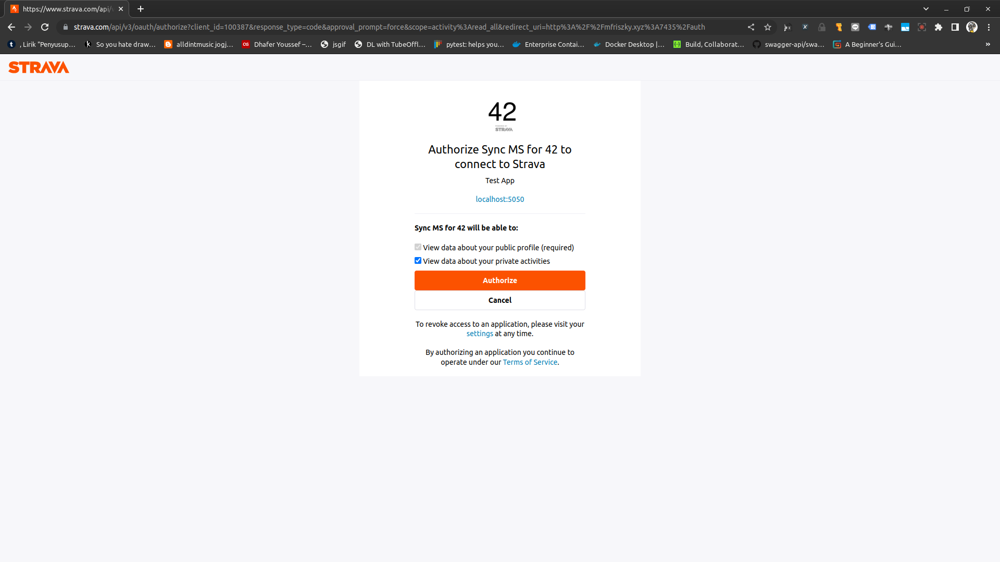

# stravapi

## Strava API Backend for 42Mini App

### Usage
1. Clone this repository
2. Install requirements using `npm install`
3. Run the middleware using `npm start`

### Requirements
- Strava Api Access. You can create it in [https://www.strava.com/settings/api](https://www.strava.com/settings/api)
- MongoDB
- Redis

##### Or you can use docker-compose
1. Create a docker-compose file
2. Run `docker build . -t stravapi`
3. Run `docker-compose up`

#### docker-compose.yml
```yml
version: '3'
services:
  api-42mini:
    image: "mfriszky/42mini:be-v1.0"
    ports:
    - "5050:5050"
    environment:
    -  MONGO_HOST=YOUR_MONGO_HOST
    -  MONGO_USER=YOUR_MONGO_USER
    -  MONGO_PASS=YOUR_MONGO_PASS
    -  MONGO_PROTOCOL=mongodb
    -  'MONGO_OPTS=YOUR_MONGO_OPTS'
    -  MONGO_DB_NAME=YOUR_MONGO_DB_NAME
    -  STRAVA_HOST=https://www.strava.com/api/v3
    -  STRAVA_TOKEN=YOUR_STRAVA_TOKEN
    -  STRAVA_REFRESH_TOKEN=YOUR_STRAVA_REFRESH_TOKEN
    -  STRAVA_CLIENT_SECRET=YOUR_STRAVA_CLIENT_SECRET
    -  STRAVA_CLIENT_ID=YOUR_STRAVA_CLIENT_ID
    -  REDIS_URL=YOUR_REDIS_CONNECTION
    -  REDIS_PASSWORD=YOUR_REDIS_PASSWORD
    -  OAUTH_REDIRECT=YOUR_OAUTH_CALLBACK
    -  JWT_SECRET=YOUR_JWT_SECRET
```

### Accessing Our Live API

1. First you have to authorized the app to access your data. Open our live app here [here](http://mfriszky.xyz:7435/) and click Connect

2. Give the app both authorization.

3. Get the 42_token value from your local storage
For firefox you can access localstorage on Dev Console > Storage > Local Storage.
For chrome you can access localstorage on Dev Console > Application > Local Storage (Bottom Left)


4. Use it on your postman access_token env


### docker-compose.yml for your local machine

```yml
version: '3'
services:
  fe-42mini:
    image: "mfriszky/42mini-fe"
    ports:
    - "7435:7435"
    environment:
    - BACKEND_API_URL=http://api-42mini:5050/api
    - APP_HOST=0.0.0.0
    - APP_PORT=7435
    - APP_ENV=STAGING
  api-42mini:
    image: "mfriszky/42mini"
    ports:
    - "5050:5050"
    environment:
    -  MONGO_HOST=mongo:27017
    -  MONGO_USER=user
    -  MONGO_PASS=password
    -  MONGO_PROTOCOL=mongodb
    -  'MONGO_OPTS=authSource=admin'
    -  MONGO_DB_NAME=my_app
    -  STRAVA_HOST=https://www.strava.com/api/v3
    -  STRAVA_TOKEN=YOUR_STRAVA_ACCESS_TOKEN
    -  STRAVA_REFRESH_TOKEN=YOUR_STRAVA_REFRESH_TOKEN
    -  STRAVA_CLIENT_SECRET=YOUR_STRAVA_CLIENT_SECRET
    -  STRAVA_CLIENT_ID=YOUR_STRAVA_CLIENT_ID
    -  REDIS_URL=redis://redis-server:6379?db=2
    -  REDIS_PASSWORD=password
    -  OAUTH_REDIRECT=http://fe-42mini:7435/auth
    -  JWT_SECRET=thisIsASecret
  redis-server:
    image: redis:6.2-alpine
    restart: always
    command: redis-server --save 20 1 --loglevel warning --requirepass password
  mongo:
    image: mongo
    restart: always
    environment:
      MONGO_INITDB_ROOT_USERNAME: user
      MONGO_INITDB_ROOT_PASSWORD: password
```

Change the following environment with your own value:
```
STRAVA_TOKEN=YOUR_STRAVA_ACCESS_TOKEN
STRAVA_REFRESH_TOKEN=YOUR_STRAVA_REFRESH_TOKEN
STRAVA_CLIENT_SECRET=YOUR_STRAVA_CLIENT_SECRET
STRAVA_CLIENT_ID=YOUR_STRAVA_CLIENT_ID
```
and register your localhost to app callback on strava api settings.


### Filtering for API Activities.

Currently filtering is only allowed on `/activities` endpoint, consisting of the following fields:
```
"sport_type",
"name",
"athlete.id",
"athlete.username",
"athlete.firstname",
"athlete.lastname"
```
We are using LHS bracket design for filtering on query params, and must use `search` as fields.

Schema:
`search[<fields_name>][<operator>]: <value>`


Example:
```raw
{
    search[athelete.username][like]: "John"
}
```

This will generate a filter for any activities with athlete's username John (case insensitive).

Supported Operator:
```
    eq:  equal,
    gt:  greater than,
    gte: greater than equals,
    lt:  Less than,
    lte: Less than equals,
    ne:  Not Equals,
    like: Equals for string, case insensitive
```

## External Link

[Front End Repo](https://github.com/riszkymf/fe-42mini)