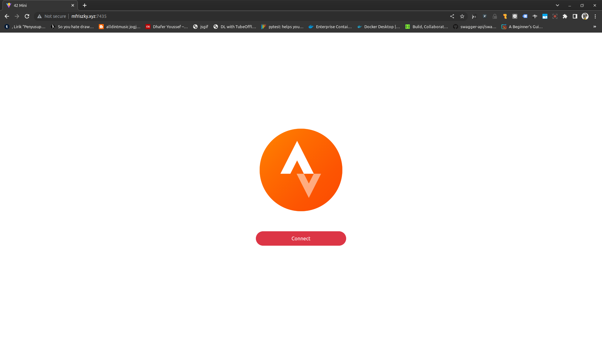

# stravapi

## Strava API Backend for 42Mini App

### Usage
1. Clone this repository
2. Install requirements using `npm install`
3. Run the middleware using `npm start`

### Requirements
- Strava Api Access. You can create it in [https://www.strava.com/settings/api](https://www.strava.com/settings/api)
- MongoDB
- Redis

##### Or you can use docker-compose
1. Create a docker-compose file
2. Run `docker build . -t stravapi`
3. Run `docker-compose up`

#### docker-compose.yml
```yml
version: '3'
services:
  api-42mini:
    image: "mfriszky/42mini:be-v1.0"
    ports:
    - "5050:5050"
    environment:
    -  MONGO_HOST=YOUR_MONGO_HOST
    -  MONGO_USER=YOUR_MONGO_USER
    -  MONGO_PASS=YOUR_MONGO_PASS
    -  MONGO_PROTOCOL=mongodb
    -  'MONGO_OPTS=YOUR_MONGO_OPTS'
    -  MONGO_DB_NAME=YOUR_MONGO_DB_NAME
    -  STRAVA_HOST=https://www.strava.com/api/v3
    -  STRAVA_TOKEN=YOUR_STRAVA_TOKEN
    -  STRAVA_REFRESH_TOKEN=YOUR_STRAVA_REFRESH_TOKEN
    -  STRAVA_CLIENT_SECRET=YOUR_STRAVA_CLIENT_SECRET
    -  STRAVA_CLIENT_ID=YOUR_STRAVA_CLIENT_ID
    -  REDIS_URL=YOUR_REDIS_CONNECTION
    -  REDIS_PASSWORD=YOUR_REDIS_PASSWORD
    -  OAUTH_REDIRECT=YOUR_OAUTH_CALLBACK
    -  JWT_SECRET=YOUR_JWT_SECRET
```

### Accessing Our Live API

1. First you have to authorized the app to access your data. Open our live app here [here](http://mfriszky.xyz:7435/) and click Connect

2. Give the app both authorization.

3. Get the 42_token value from your local storage
For firefox you can access localstorage on Dev Console > Storage > Local Storage.
For chrome you can access localstorage on Dev Console > Application > Local Storage (Bottom Left)


4. Use it on your postman access_token env
